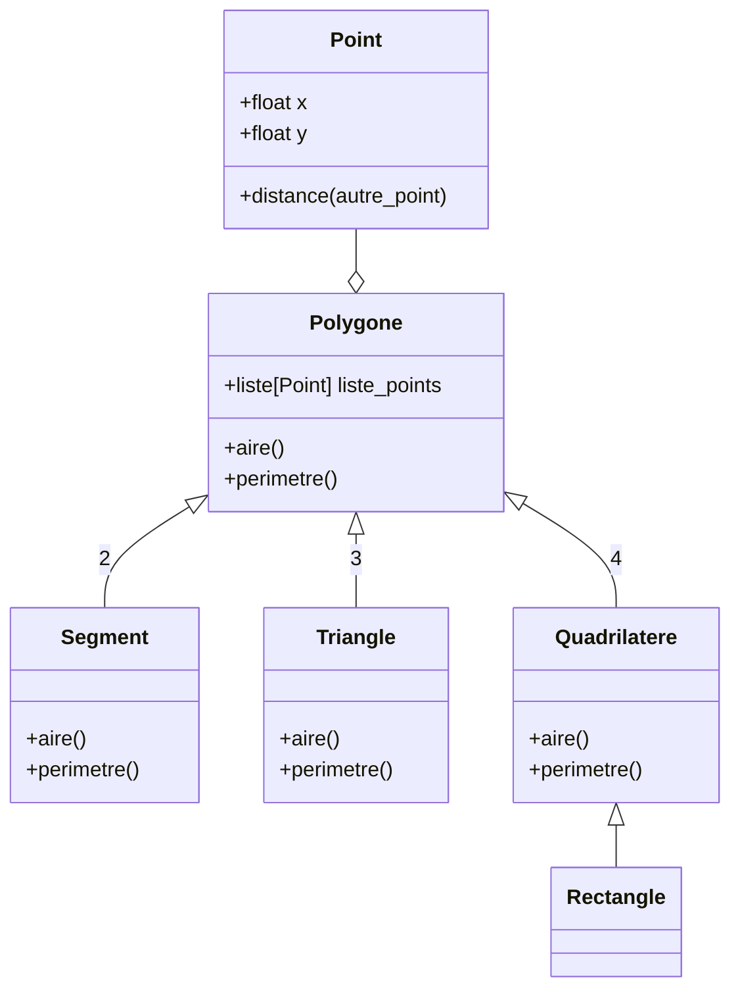
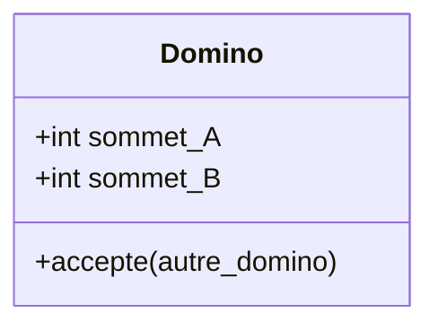

# La Programmation Orientée Objet (POO)

Nous allons introduire les notions suivantes :

* [ ] Principe de la POO
* [ ] L'organisation du code
* [ ] L'héritage
* [ ] Les classe abstraites

## :arrow_forward: Introduction

La POO est un paradigme de programmation qui permet d'organiser et de structurer le code en utilisant des objets. Les objets sont des entités qui regroupent des données (**attributs**) et des actions (**méthodes**) qui leur sont associées. La POO repose sur plusieurs principes fondamentaux :

* **Encapsulation** : L'encapsulation consiste à regrouper les données et les méthodes qui les manipulent au sein d'un même objet. Cela permet de cacher les détails d'implémentation et de fournir une interface cohérente pour interagir avec l'objet
* **Héritage** : L'héritage permet de créer de nouvelles classes à partir de classes existantes, en héritant de leurs attributs et méthodes. Cela favorise la réutilisation du code et la création d'une hiérarchie de classes
* **Polymorphisme** : Le polymorphisme permet à des objets de classes différentes de répondre de manière différente à une même action. Cela permet de manipuler des objets de différentes classes de manière uniforme, en utilisant des interfaces communes

La POO permet :

* d'organiser le code de manière plus structurée
* de favoriser la réutilisation et la maintenance du code
* de modéliser les concepts du domaine d'application de manière naturelle

Elle est largement utilisée dans de nombreux langages de programmation, dont Python, pour développer des applications complexes et évolutives.

---

## :arrow_forward: Organisation du code

Dans la suite, nous allons organsier notre code de manière logique dans différents modules.

> **module** : Les modules d’un programme Python sont ses fichiers sources.

> **paquet** : Un paquet (package en anglais) est un ensemble de modules dans le même dossier.

### :bulb: bonne pratique

A la racine de votre projet, créez les 3 dossiers suivants :

* **src** : pour stocker votre code source
* **data** : pour vos fichiers de données
* **doc** : pour votre documentation

```
.
├── data
│   └── temperatures.csv
├── doc
│   ├── suivi.md
│   └── rapport.tex
└── src
    ├── __main__.py
    ├── package1
    │   ├── __init__.py
    │   ├── module1.py
    │   ├── module2.py
    └── package2
        ├── __init__.py
        ├── module3.py
        └── subpackage21
            ├── __init__.py
            ├── module4.py
            ├── module5.py
```

Remarques importantes :

* le fichier `__main__.py` contient le code à exécuter quand le pacakge est exécuté
* les fichiers `__init__.py` sont des fichiers qu'il faut créer dans chaque module pour pouvoir les utiliser (c'est comme ça...)

Voici un exemple plus concret :

```
.
└── src
    ├── __main__.py
    ├── vehicules
    │   ├── __init__.py
    │   ├── deux_roues.py
    │   ├── velo.py
    │   └── trottinette.py
    └── humain
        ├── __init__.py
        ├── personne.py
        └── etudiant.py
```

---

## :arrow_forward: Héritage

Un des trois piliers de la POO est l'héritage.  
Une classe enfant peut utiliser tous les attributs et méthode de sa classe parente.  
Ce principe d'héritage permet également de mettre en commun des attributs et méthodes pour éviter des duplications de code.  

Supposons que dans notre code, nous voulons gérer des vélos et de trottinettes. L'idée naïve est de créer une classe pour chacun.

En réfléchissant un peu, nous nous disons que ces 2 classes ont des attributs et méthodes en commun :

* couleur
* vitesse
* accelerer()
* ralentir()

Une idée est de regrouper ces caractéristiques communes dans une classe `DeuxRoues`. Puis de faire hériter `Vélo` et `Trottinette` de `DeuxRoues`

### Classe Abstraite

Certaines classes n'ont pas vocation à être instanciée. Par exemple, nous n'allons pas créer d'objets de la classe `DeuxRoues`. Nous allons directement créer des `Velo` et des `Trottinettes`.

Nous pouvons donc définir la classe `DeuxRoues`comme **abstraite**

* c'est à dire qui ne peut pas être instanciée
* dit autrement : on ne peut pas créer d'objets de cette classe

La principale utilité des classes abstraites est de définir un contrat  pour les classes filles. Elles fournissent une structure et une organisation cohérentes pour les classes qui partagent des caractéristiques communes, tout en permettant une flexibilité pour les implémentations spécifiques à chaque classe fille.

> En Python, la notion de classe abstraite est implémentée grâce au module abc (Abstract Base Classes). Ce module fournit le décorateur @abstractmethod qui permet de déclarer une méthode comme abstraite dans une classe abstraite. Une classe abstraite est définie en héritant de la classe ABC du module abc.

:warning: classe mère ne veut pas dire forcément classe abstraite

Exemple :

* Considérons par exemple une classe `VeloElectrique` qui hérite de la classe `Velo`
* Cela parait cohérent car un vélo électrique est un vélo (donc hérite de tous ses attributs et méthodes) avec des caractéristiques supplémentaires (batterie, autonomie, puissance...)
* Or ici la classe `Velo` n'a pas vocation à être abstraite car il n'est pas absurde de créer un objet vélo

---

## :arrow_forward: Exercices

### Exercice 1 - Points

Définissez une classe `Point` pour représenter un point du plan de coordonnées x et y.
Coder les méthodes suivantes :

* [ ] `__init__(self, x, y)` : constructeur du point avec des coordonnées cartésiennes
* [ ] `r(self)` et `t(self)` : renvoyant les coordonnées polaires du point
* [ ] `__str__(self)` : pour afficher le Point sous forme de texte, ex : `(1.0, 2.4)`
* [ ] `distance(self, autre_point)` : distance avec un autre point
* [ ] `__eq__(self, autre_point)` : renvoi un booléen qui dit si les 2 points sont identiques
* [ ] `homothetie(self, k)` : appliquant au point une homothétie de centre (0, 0) et de rapport k
* [ ] `translation(self, dx, dy)` : appliquant au point une translation de vecteur (dx, dy)
* [ ] (bonus) `rotation(self, a)` : appliquant au point une rotation de centre (0, 0) et d’angle a

### Exercice 2 - Polygones

* [ ] Créer une classe `Polygones` composées d'objets de la classe `Point`
  * nous supposerons par la suite que les segments ne se croisent pas
* [ ] Ajouter à cette classe 2 méthodes abstraites `aire()` et `périmètre()` qui seront définies dans les classes filles
* [ ] Créer les classes `Segment`, `Triangle` et `Quadrilatere` qui héritent de la classe `Polygone`
  * vérifier à chaque fois le nombre de points
  * [ ] Définir les méthodes `aire()` et `périmètre()` dans ces classes
* [ ] Créer la classe `Rectangle` qui hérite de `Quadrilatere`
  * vérifier que les 2 cotés opposés sont de même longeur et qu'il y a un angle droit

[Diagrammes de classe avec Mermaid](https://mermaid.js.org/syntax/classDiagram.html)



### Exercice 2 - Domino

Ecrire une classe `Domino` avec :

* 2 attributs entiers entre 1 et 6 : `extr_A` et `extr_B`
* `__str__()` : qui affiche les points présents sur les deux extrémités
* `retourne()` qui retourne le domino (son extrémité A devient son extrémité B et vice-versa).
* `accepte_apres(autre_domino)` : vérifie si l’extrémité B du domino courant a la même valeur que l’extrémité A de l'autre domino

Ecrivez une fonction affiche_dominos() qui affiche une liste de dominos.

Ecrivez une fonction jeu_possible(jeu, dominos_poses) qui prend deux listes de dominos en arguments. La fonction retourne vrai s’il existe un domino de jeu qui pourrait être accepté après le dernier domino de dominos_poses.


