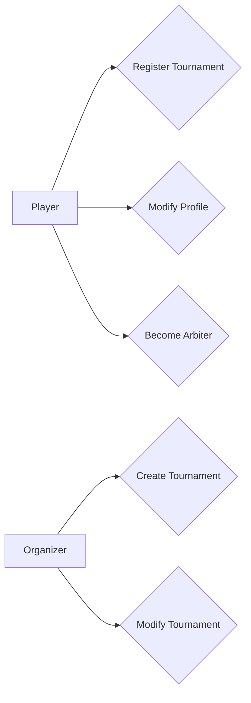

# Diagramme de cas d'utilisation

Un diagramme de cas d'utilisation UML (Unified Modeling Language) est un type de diagramme utilisé pour représenter les interactions entre les acteurs (utilisateurs ou systèmes externes) et le système logiciel. Il met l'accent sur les fonctionnalités fournies par le système du point de vue des utilisateurs.

Un diagramme de cas d'utilisation se compose de plusieurs éléments clés :

* **Acteur** : Un acteur représente un rôle joué par un utilisateur ou un système externe qui interagit avec le système logiciel. Il peut s'agir d'une personne, d'un autre système, d'un périphérique matériel, etc. Les acteurs sont représentés par des silhouettes ou des icônes à l'extérieur du diagramme.
* **Cas d'utilisation** : Un cas d'utilisation représente une fonctionnalité ou une action que le système logiciel fournit à ses acteurs. Il décrit une interaction entre les acteurs et le système pour atteindre un objectif spécifique. Les cas d'utilisation sont représentés par des ovales à l'intérieur du diagramme, avec leur nom correspondant.
* **Relation d'association** : Les relations d'association connectent les acteurs aux cas d'utilisation pour montrer quel acteur utilise quel cas d'utilisation. Elles indiquent l'interaction entre les acteurs et le système.
* **Inclusion et extension** : Ces relations décrivent les dépendances entre les cas d'utilisation. L'inclusion représente une relation d'inclusion où un cas d'utilisation inclut ou utilise un autre cas d'utilisation. L'extension représente une relation d'extension où un cas d'utilisation peut étendre un autre cas d'utilisation en ajoutant des fonctionnalités supplémentaires.

Les diagrammes de cas d'utilisation UML sont utilisés pour capturer les exigences fonctionnelles du système, identifier les acteurs impliqués, décrire les interactions entre les acteurs et le système, et définir les fonctionnalités attendues du système. Ils aident à communiquer efficacement les besoins des utilisateurs et à guider le processus de développement logiciel en se concentrant sur les objectifs de l'utilisateur final.

## Outils

* [PlantUML](http://www.plantuml.com/)
  * [exemple](https://github.com/ludo2ne/projet-info-2A/blob/main/doc/diagrammes/diag_cas_utilisation.txt)
  * Mermaid

