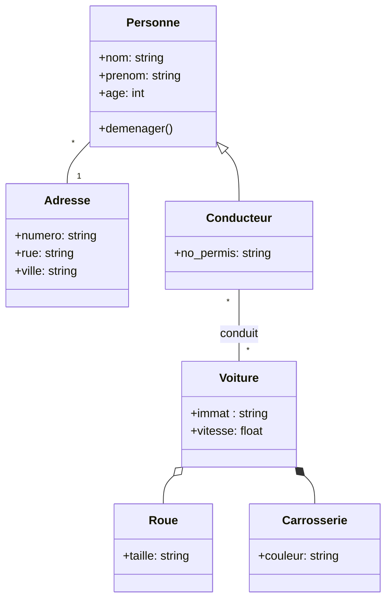

# Diagramme de classe

Un diagramme de classes UML (Unified Modeling Language) est un type de diagramme utilisé pour représenter la structure statique d'un système logiciel. Il montre les classes du système, leurs attributs, leurs méthodes et les relations entre les classes.

Un diagramme de classes UML se compose de différentes boîtes représentant les classes, avec des lignes qui connectent ces boîtes pour montrer les relations entre les classes. Voici quelques éléments clés que l'on retrouve généralement dans un diagramme de classes :

* **Classe** : Elle est représentée par une boîte avec trois sections :
  * le nom de la classe
  * les attributs
  * les méthodes
* **Relation d'association** : Une relation d'association représente une connexion entre 2 classes. Elle montre que les objets d'une classe sont associés aux objets d'une autre classe. Par exemple, une classe `Étudiant` peut être associée à une classe `Cours` via une relation d'association pour indiquer que les étudiants suivent des cours.
* **Héritage** : Cela permet de modéliser les concepts de généralisation et de spécialisation.
* **Agrégation et Composition** : Ces relations décrivent la structure des classes et leur association avec d'autres classes.
  * L'agrégation est une relation où une classe peut être composée d'autres classes, mais ces classes peuvent exister indépendamment
  * La composition est une relation plus forte où une classe est composée d'autres classes, et ces classes n'existent pas sans la classe parente.
* **Multiplicité** : La multiplicité spécifie le nombre d'objets d'une classe associés à un ou plusieurs objets d'une autre classe dans une relation d'association. Elle est représentée par des nombres ou des symboles tels que "0..1", "1", "*", etc.

Les diagrammes de classes UML sont utilisés pour modéliser la structure conceptuelle d'un système logiciel, identifier les classes et leurs relations. Ils fournissent une représentation visuelle et standardisée pour analyser, concevoir et documenter les systèmes orientés objet.

## :arrow_forward: Outils

* [PlantUML](http://www.plantuml.com/)
  * [exemples](https://github.com/ludo2ne/projet-info-2A/tree/main/doc/diagrammes)
* [Mermaid](https://mermaid.js.org/syntax/classDiagram.html)

## :arrow_forward: Exemple

