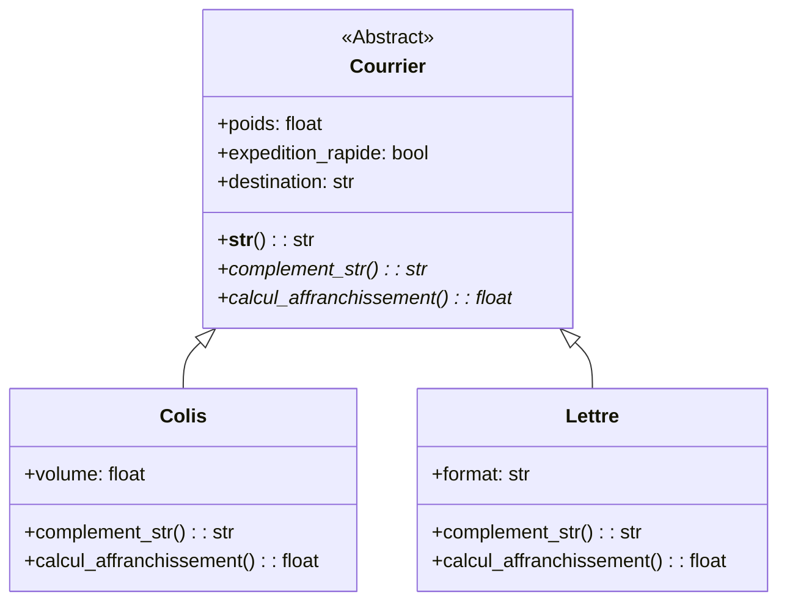

# Diagramme de classe

```mermaid
classDiagram
    class Courrier {
        <<Abstract>>
        +poids: float
        +expedition_rapide: bool
        +destination: str

        +__str__(): str
        +complement_str()*: str
        +calcul_affranchissement()*: float
    }

    class Colis {
        +volume: float
        +complement_str(): str
        +calcul_affranchissement(): float
    }

    class Lettre {
        +format: str
        +complement_str(): str
        +calcul_affranchissement(): float
    }

    Courrier <|-- Colis
    Courrier <|-- Lettre
```
