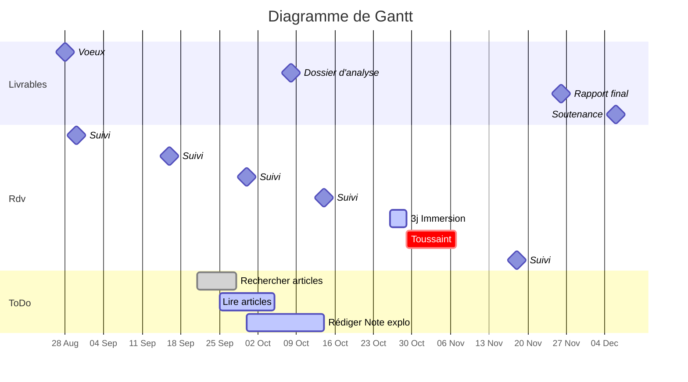

- [ ] Allez sur <https://hackmd.io/>
- [ ] Créez une nouvelle note
- [ ] Coller le code ci-dessous

---

:::warning
Avec [**HackMd**](https://hackmd.io/c/tutorials), vous pouvez créer un page qui vous servira à suivre l'avancement de votre projet. Le langage utilisé ([markdown](https://fr.wikipedia.org/wiki/Markdown)) est assez intuitif, de plus en plus populaire et très utilisé à l'INSEE. Les [fonctionnalités proposées](https://hackmd.io/features?both) sont nombreuses.

En haut à gauche vous avez 3 modes : éditer :pencil2: , éditer et voir [|], voir :eye:
En haut à droite, diverses options, par exemple pour gérer les accès en lecture/écriture

Si vous voulez essayer, copiez le contenu de gauche (sur fond noir), créez une nouvelle page hackmd, collez, et c'est parti
:::

-------------------------------------------------------

:::success

- **Sujet** : Dynamisme et attractivité des territoires
- [Observatoire des territoires](https://www.observatoire-des-territoires.gouv.fr/) --- [Cartographie interractive](https://www.observatoire-des-territoires.gouv.fr/outils/cartographie-interactive/#c=indicator&view=map38)
- **Tuteur / Tutrice** : Rick Auray (<rick.auray@ensai.fr>)
- **Coach** : Ella Lapêche
- [Dépôt GitLab](https://gitlab.com/ludo2ne/projet-info-1a)
:::

-------------------------------------------------------
# :dart: Échéances
-------------------------------------------------------

:::danger
Rapport final :clock1: <iframe src="https://free.timeanddate.com/countdown/i83zdl7u/n1264/cf11/cm0/cu2/ct4/cs0/ca0/co0/cr0/ss0/cac009/cpcf00/pcfff/tcfff/fs100/szw256/szh108/iso2022-11-26T23:59:00" allowtransparency="true" frameborder="0" width="130" height="16"></iframe>
:::



-------------------------------------------------------
# :calendar: Livrables
-------------------------------------------------------

| Date    | Livrables                                                    |
| ------- | ------------------------------------------------------------ |
| 10 oct. | ~~Note exploratoire~~                                        |
| 2 nov.  | cahier des charges : contenu process <br> visualisation sous forme de GANTT |
| 26 nov. | livrable coaching - application de la méthode des 5PI        |
| 2 déc.  | [introduction rédigée,  plan détaillé, principaux résultats](https://www.overleaf.com/read/qmjjpbkybpmy) |
| 19 déc. | [Rapport intermédiaire](https://www.overleaf.com/read/qmjjpbkybpmy) (:hammer_and_wrench:  [correcteur orthographe et grammaire](https://www.scribens.fr/))            |

-------------------------------------------------------
# :left_speech_bubble: Discussions
-------------------------------------------------------

> [color=purple][name=Tryphon ] Pour le clustering, est-ce qu'on utilise plutôt le critère de Ward ou le single linkage ?
>> [color=green][name=Bianca] En fait on va plutôt faire un kmeans

> [color=yellow][name=Archibald] Ca fait quoi ce code ?

```sas=
PROC FREQ DATA = travail.seniors_zones;
  TABLE centrale - typ_pop / NOCOL NOPERCENT;
RUN;
```

-------------------------------------------------------
# :construction: Todo List
-------------------------------------------------------

:::warning
:rotating_light: **Priorité 1**

- [ ] Savoir calculer une moyenne

:::

- [x] Créer page ++hackMd++
- [ ] Trouver problèmatique
  - [ ] Comprendre le sujet
- [ ] Lire articles

-------------------------------------------------------
# :clock2: Timeline
-------------------------------------------------------

> partie très très utile pour noter ce qui a été fait et quand ça a été fait

### 2022.10.20 Point tuteur / tutrice

- [ ] Comment on calcule une moyenne géométrique ?
- [ ] Pourquoi on doit utiliser ==SAS== ?

### 2022.09.30 Liste d'articles pour Note exploratoire

1. <https://www.insee.fr/fr/statistiques/1281062>
2. <https://www.insee.fr/fr/statistiques/2411498>
3. <https://www.insee.fr/fr/statistiques/2422226>

### 2022.09.22 Choix des sujets

- [x] [Classer les sujets](https://lite.framacalc.org/9pr8-projetstatensaigroupe26)
- [x] envoyer liste des voeux le mardi 21 septembre avant 18h
  - 5. Caractéristiques des territoires frontaliers.
  - 9. Dynamisme et impact de la métropolisation.
  - 19. Niveau de vie, chômage et précarité.
  - 14. Dynamisme et attractivité des territoires.
  - 20. Tissu économique et richesse.

### 2022.09.15 Composition du groupe

- Bianca
- Tryphon
- Archibald

-------------------------------------------------------
# :gift: Bonus - Modifier le style avec le CSS
-------------------------------------------------------

:bulb: Vous trouvez que cette page manque de couleur et de style. Heureusement le css est là pour vous aider (**[Basic CSS Guide](https://www.geeksforgeeks.org/css-cheat-sheet-a-basic-guide-to-css/)**).

Décommenter le code ci-dessous (enlever les \`\`\` juste avant et juste après les 2 balises `<style>`) pour appliquer une autre mise en forme que vous pouvez modifier à votre guise.

```css=
<style>
   /- headers level 1 # */
    h1{
        color: darkblue;
        font-family: "Calibri";
        background-color: khaki;
        text-align: center;
        padding-left: 10px; 
    }

   /- headers level 3 ### */
    h3{
        color: darkgreen;
        background-color: pink;
        text-align: left;
        margin-right: 100px;
    }

   /- paragraphs */
    p{
        text-align: justify;
    }
    
    /- unordered lists */
    ul{
        color: #400000;   
    }
    
    /- ordered lists*/
    ol{
        font-family: "Papyrus";
        font-size: 18px;        
    }

</style>
```


