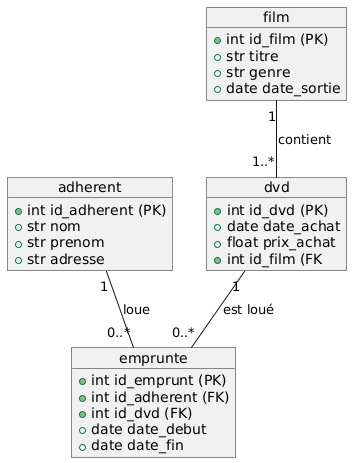

## Instructions {.unnumbered}

- Examen sur papier
- Durée : 1h30
- Sans documents
- Sans calculatrice

::: {.callout-important title="À lire avant de commencer"}
Le sujet est composé de plusieurs pages, numérotées de 1 à la dernière page.

- Le sujet vous paraîtra peut-être un peu long. Ne perdez pas de temps si vous bloquez sur une question, passez à la suivante.
- Les exercices peuvent être traités dans l'ordre de votre choix.
- Dans chaque exercice, les questions ne sont pas forcément de difficulté croissante.
- Les différentes questions attendent des [réponses courtes]{.underline}.
- Respectez scrupuleusement les consignes. Cependant, si une question ne vous semble pas claire, notez sur votre copie la manière dont vous l'avez comprise et traitée.
- Quand du code est demandé, veuillez respecter les règles de bases du langage (mots clefs et indentation). Des erreurs seront tolérées, car vous êtes sur papier. En cas d'oubli d'un nom de méthode Python, utilisez du pseudo-code.
- Sauf mention contraire, il n'est pas demandé d'écrire la documentation du code (même si la doc c'est bien !)
:::

Bonne chance !



## Python (7 points)

a. Créez une collection adaptée qui permet de stocker les clés et valeurs suivantes :

- `numero` : 23
- `voie` : "Boulevard Gambetta"
- `code_postal` : "02300"
- `ville` : "Chauny"
- `zone_inondable` : `False`

b. Que va afficher le code ci-dessous ?

```{.python}
liste = [0, 1, 2, 3, 4, 5]
liste.append(12)
print(liste[-1])
liste2 = liste
liste2.pop()
print(len(liste))
```

c. Écrivez le code d'une fonction qui prend en entrée une chaîne de caractères et retourne le nombre de voyelles contenues dans cette chaîne de caractères.

d. Recopiez et complétez ce code pour n'afficher que les valeurs de `i` paires et sortir de la boucle quand `i` est égal à 0. Que va afficher votre code ?

```{.python}
i = 10
while True:
    i = i - 1
    # Completer ici
    print(i, end = " ")
    # Completer ici
print("\nboom")
```

e. Écrivez le code d'une fonction qui prend en entrée un entier $n$ et affiche les $n$ premières valeurs de la suite de Fibonacci.

Rappel : $F_0 = 0$ et $F_1 = 1$ et $ \forall n \ge 2,\ F_n = F_{n-1} + F_{n-2}$

f. Écrivez le code d'une fonction qui prend en entrée une température en Celsius et retourne celle-ci convertie en Fahrenheit ($F = \frac{9}{5} \times C + 32$)



## SQL (7 points)

Nous modélisons les données de gestion d'un système de location de dvd.

Le schéma des données est le suivant (PK : Primary Key, FK : Foreign Key) :

{width=60%}

Un adhérent peut emprunter plusieurs dvd.
Un emprunt est caractérisé par un numéro d'emprunt, la date de début, la date de fin, le numéro d'adhérent et le numéro du dvd emprunté.
Un dvd contient un seul et unique film. Un film peut-être disponible sur plusieurs dvd différents.

Écrivez la requête SQL qui répond à chaque question ci-dessous.

a. Listez tous les films du genre « science-fiction » par en classant en premier ceux qui sont sortis le plus récemment.
b. Listez tous les films qui contiennent dans leur titre le mot « batman ».
c. Donnez le prix d'achat moyen des dvd du film « Alibi ».
d. Donnez les noms et prénoms des adhérents ayant déjà emprunté le film « Matrix ».
e. Listez les identifiants des dvd qui n'ont jamais été empruntés.
f. Listez les titres des films qui ont été empruntés plus de 10 fois.
g. Insérer en base de données le film Barbie du genre « comédie » sorti le 19 juillet 2023.

[Quelques mots-clés en SQL]{.underline} : `SELECT`, `FROM`, `WHERE`, `GROUP BY`, `HAVING`, `ORDER BY`, `ASC`, `DESC`, `JOIN`, `LEFT JOIN`, `RIGHT JOIN`, `FULL JOIN`, `ON`, `USING`, `INSERT INTO`, `UPDATE`, `SET`, `DELETE FROM`, `CREATE TABLE`, `ALTER TABLE`, `ADD COLUMN`, `DROP TABLE`, `DISTINCT`, `AS`, `COUNT`, `AVG`, `SUM`, `MAX`, `MIN`, `AND`, `OR`, `BETWEEN`, `LIKE`, `IS NULL`



## UML et POO (6 points)

Un magasin de légumes souhaite créer une application pour gérer son stock, ses clients et les commandes.

Chaque légume à un type, une variété, un prix et son stock (en kg).

Le magasin dispose également d'une liste de clients qui sont définis par leurs numéros de client, nom, prénom, âge et s'ils possèdent la carte de fidélité du magasin.

Une commande possède un numéro de commande, un montant total initialement à 0, et est réalisée par un client. Une commande est décomposée en lignes de commandes. Chaque ligne contient un légume et une quantité.

a. Proposez un diagramme de classes UML pour décrire l'application ci-dessus.
b. Écrivez le constructeur de la classe `Commande`.
c. Écrivez le code de la méthode `valider_commande()` qui permet de :
  - vérifier si une commande est valide (si le stock de légumes est suffisant)
  - calcule et met à jour le montant total de la commande si la commande est valide
  - retourne True si la commande est valide, False sinon
