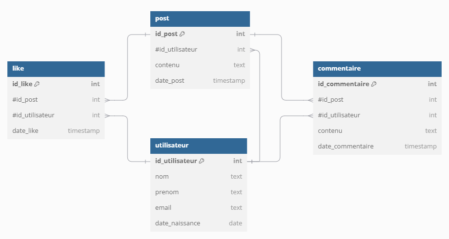

## Instructions {.unnumbered}

- Examen sur papier
- Durée : 1h30
- Sans documents
- Sans calculatrice

::: {.callout-important title="À lire avant de commencer"}

Le sujet est composé de plusieurs pages, numérotées de 1 à la dernière page.

- Le sujet vous paraîtra peut-être un peu long. Ne perdez pas de temps si vous bloquez sur une question, passez à la suivante.
- Les exercices peuvent être traités dans l'ordre de votre choix.
- Dans chaque exercice, les questions ne sont pas forcément de difficulté croissante.
- Les différentes questions attendent des [réponses courtes]{.underline}.
- Respectez scrupuleusement les consignes. Cependant, si une question ne vous semble pas claire, notez sur votre copie la manière dont vous l'avez comprise et traitée.
- Quand du code est demandé, veuillez respecter les règles de base du langage (mots clefs et indentation). Des erreurs seront tolérées, car vous êtes sur papier. En cas d'oubli d'un nom de méthode Python, utilisez du pseudo-code.
- Sauf mention contraire, il n'est pas demandé d'écrire la documentation du code (même si la doc c'est bien !)
:::

Bonne chance !




## Python (7 points)

### Questions

a. Écrivez le code d'une fonction qui affiche un compte à rebours à partir d'une valeur `n`.

Affichage attendu : `5 4 3 2 1 0 boom`.

b. Que va afficher le code ci-dessous ?

```{.python}
for i in range(10):
    if i == 5:
        break
    if i == 3:
        continue
    print(i)
```

c. Complétez la classe `Velo` ci-dessous en créant les méthodes suivantes :

- `accelerer` : méthode pour augmenter la vitesse du vélo d'une valeur `v`.
- `ralentir` : méthode pour diminuer la vitesse du vélo d'une valeur `v`.
- `installer_porte_bagage` : méthode pour installer un porte-bagage sur le vélo.

```{.python}
class Velo:
    def __init__(self, couleur, porte_bagage=False):
        self.couleur = couleur
        self.vitesse = 0
        self.porte_bagage = porte_bagage
```

d. Créez un vélo bleu. Installez-lui un porte-bagage et faites-le rouler à 20 km/h.

e. Écrivez le code d'une fonction qui prend en paramètre une liste et retourne cette liste sans doublons.

f. Écrivez le code d'une fonction qui prend en entrée une chaîne de caractères et retourne le nombre d'occurrences de chaque lettre.



## SQL (7 points)

Nous modélisons les données d'un réseau social très simple où les utilisateurs peuvent :

- créer des posts ;
- liker des posts ;
- commenter des posts.

{width=95%}

Écrivez la requête SQL qui répond à chaque question ci-dessous.

a. Listez tous les utilisateurs (nom et prénom) par ordre alphabétique.
b. Listez les contenus de commentaires contenant à la fois la lettre Z et la lettre W.
c. Quels sont les posts (contenu et nom d'utilisateur) où l'utilisateur a commenté un post qu'il a lui-même écrit ?
d. Combien de commentaires a écrit chaque utilisateur ? Incluez ceux qui n'ont jamais écrit de commentaire.
e. Comment vérifier qu'aucun utilisateur n'a pu liker deux fois un même post ?
f. Comment vérifier qu'un utilisateur n'a pas pu liker un post écrit par lui-même ?
g. Supprimer le post d'id `8888`.

[Quelques mots-clés en SQL]{.underline} : `SELECT`, `FROM`, `WHERE`, `GROUP BY`, `HAVING`, `ORDER BY`, `ASC`, `DESC`, `JOIN`, `LEFT JOIN`, `RIGHT JOIN`, `FULL JOIN`, `ON`, `USING`, `INSERT INTO`, `UPDATE`, `SET`, `DELETE FROM`, `CREATE TABLE`, `ALTER TABLE`, `ADD COLUMN`, `DROP TABLE`, `DISTINCT`, `AS`, `COUNT`, `AVG`, `SUM`, `MAX`, `MIN`, `AND`, `OR`, `BETWEEN`, `LIKE`, `IS NULL`



## UML et POO (6 points)

Un cabinet médical souhaite développer une application pour gérer ses médecins, ses patients et leurs rendez-vous.

Un Médecin possède un identifiant, un nom, un prénom et une année de diplôme.

Parmi les médecins, il y a deux catégories :

- Généraliste, avec un attribut supplémentaire indiquant s’il effectue des déplacements à domicile.
- Spécialiste qui a un tarif spécial pour les consultations.

Un Patient est défini par un nom, un prénom, un NIR (numéro de sécurité sociale) et éventuellement un médecin traitant. Un patient doit pouvoir déclarer, modifier ou supprimer son médecin traitant.

Un rendez-vous est caractérisé par une date, une heure, un médecin, un patient et un statut (à venir, terminé, annulé, non honoré).

a. Proposez un diagramme de classes UML représentant ces entités et leurs relations.
b. Écrivez le constructeur de la classe Généraliste.
c. Écrivez le code de la méthode qui permet à un patient de déclarer un médecin traitant.

